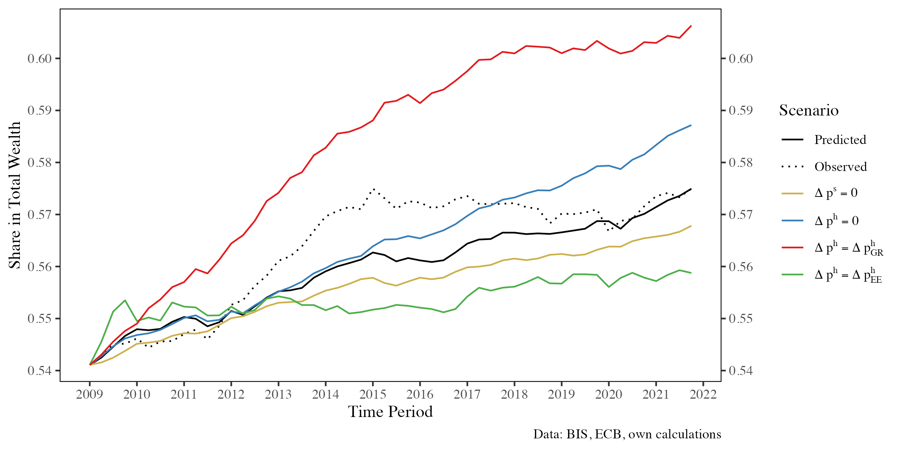

# Cementing the Divide? 

## Housing and Wealth Inequality across Europe

This repository contains the data, code, and documentation for my Bachelor's thesis project analyzing housing prices as a driver of wealth inequality in Europe. The Final Result is available as [a PDF](https://raw.githubusercontent.com/skriptum/inequality/refs/heads/main/text/main.pdf) or [a Website](https://html-preview.github.io/?url=https://github.com/skriptum/inequality/blob/main/text/main.html). 

## Abstract

How do asset prices shape the wealth distribution? Motivated by the different trajectories of European housing markets after the financial crisis, this thesis examines how capital gains, particularly in housing, influence wealth inequality in Europe. Drawing on the ECB’s new Distributional Wealth Accounts, the analysis uses panel regressions that exploit cross-country variation in housing markets. The results show that asset prices have first-order consequences on the wealth distribution, driven by differences in portfolio composition across population groups. Rising house prices increase the shares of the middle 40% and especially the bottom 50%, while a booming stock market mainly benefits the top 10%. These effects are robust across specifications but vary substantially across countries, reflecting institutional and portfolio differences. Simulations of alternative price scenarios show that housing booms can slow concentration. However, no country saw house prices grow fast enough to reverse the upward trend in top wealth shares. Together, the results provide detailed insights into the distributional effects of asset prices in Europe, with implications for both monetary and housing policy.

## Selected Figures

**Descriptive: Trends in European Wealth Groups**

 

**Simulation: Counterfactual Top 10% Wealth Share**

 

**Analysis: Owner-Tenant Wealth Rations across Europe**


## Project Structure

```text
.
├── data/               
│   ├── raw/            # Original files (Excel, CSV)
│   ├── processed/      # Cleaned and structured datasets
│   └── models/         # Model files
├── src/                
│   ├── 01_preparation/ # Data cleaning and preparation files
│   ├── 02_analysis/    # Econometric models and simulations
│   ├── 03_reporting/   # Plots, tables, robustness checks
│   └── _archive/       
├── output/             # Exported figures / tables
│   ├── appendix/
│   ├── desc/
│   ├── paneltables/
│   ├── simulation/
│   └── ts_tables/
├── text/               # final text files
│   └── notes/          
├── docs/               # Methodological references
├── renv/               # R package environment
├── renv.lock           # Reproducible package snapshot
├── bachelor.bib        # BibLatex Bibliography File
├── README.md             
```


## Setup Instructions

1. Open inequality.Rproj in RStudio.
2. Run renv::restore() to install the required packages.
3. Download the full dataset in csv format from the ECB website ([here](https://data-api.ecb.europa.eu/service/data/DWA?format=csvdata)) and place it in `data/raw/DWA_ECB.csv`
4. Execute scripts in src/ in order:
     - 01_preparation/
     - 02_analysis/
     - 03_reporting/


## Text Production

The PDF / HTML is produced using [quarto](https://quarto.org). 

`main.qmd` contains the relevant YAML options and includes the respective chapters. Figures and tables are drawn automatically from the `output` directory.

To create the result, make sure to have `quarto` , `pandoc` and a version of LaTeX installed. CD into the `text` directory, then run `quarto render main.qmd --to aea-pdf` to produce the final thesis.


## Dependencies

Managed via renv. See renv.lock for exact package versions.

